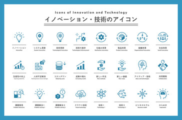

## Web Developer | Full Stack Developer | AI Specialist

---

## About Me

I am a passionate and adaptable developer with over a decade of experience in building innovative applications and websites. I specialize in **frontend development**, **AI solutions**, and **mobile app development**, thriving on solving complex challenges through technology. I am committed to continuous learning and delivering high-quality solutions that exceed client expectations.

---

## Skills

- **Programming Languages:** HTML, CSS, JavaScript, Python, PHP, Swift, Java
- **Frameworks:** React, Redux, Node.js, Express.js, React Native, TensorFlow, Keras
- **Databases:** MySQL, MongoDB, PostgreSQL, Firebase
- **Tools:** Git, Docker, Postman, JIRA, Visual Studio Code, Xcode, Android Studio
- **Operating Systems:** Windows, macOS, Linux
- **Networking:** RESTful APIs, GraphQL

---
<!--
## Work Experience

### Freelance Developer
**April 2024 - Present**  
- Developed 12 diverse projects, including custom websites and desktop applications.
- Utilized modern frameworks like React and Node.js.
- Enhanced problem-solving abilities and adaptability to client needs.

### Lead Developer, 株式会社Frog&Fluid
**November 2021 - April 2024**  
- Spearheaded the development of an innovative e-commerce platform.
- Enhanced user experience and streamlined payment processes using React and Redux.
- Achieved significant improvements in transaction efficiency and customer satisfaction.

### Core Developer, FoodMarketHub
**March 2020 - October 2021**  
- Designed and implemented a comprehensive food delivery application.
- Optimized delivery algorithms using Node.js and Express.js.
- Increased user ratings and engagement through effective functionality enhancements.

### Freelance AI Developer
**July 2019 - March 2020**  
- Developed AI-driven applications for data analysis and machine learning.
- Collaborated with data scientists to improve model accuracy using Python and TensorFlow.

### Application Developer, ANYOMA SDN. BHD.
**April 2015 - April 2018**  
- Contributed to various mobile applications, focusing on user experience and functionality.
- Utilized React Native and Swift for high-quality app development.

### Backend Developer, ANYOMA SDN. BHD.
**February 2013 - April 2015**  
- Implemented backend solutions using PHP and MySQL.
- Enhanced user experience through effective database management.

### Frontend Developer, ANYOMA SDN. BHD.
**October 2010 - February 2013**  
- Developed and launched various websites, establishing a strong foundation in web technologies.

---

## Projects

### [Project Name]
- **Description:** Brief description of the project, its purpose, and your role.
- **Technologies Used:** List the technologies, frameworks, and tools used.
- - **Link:** [GitHub Repository URL or Live Demo URL] 

### [Project Name]
- **Description:** Brief description of the project, its purpose, and your role.
- **Technologies Used:** List the technologies, frameworks, and tools used.
- **Link:** [GitHub Repository URL or Live Demo URL] 

### [Project Name]
- **Description:** Brief description of the project, its purpose, and your role.
- **Technologies Used:** List the technologies, frameworks, and tools used.
 - **Link:** [GitHub Repository URL or Live Demo URL]

(Continue adding projects as needed)
 
---

## Testimonials
*(Optional: Include any testimonials from clients or colleagues that speak to your skills and work ethic.)*

---
-->
## Contact Me

Feel free to reach out for collaboration, freelance opportunities, or just to connect!
 <!--
- [Email]  
- [LinkedIn Profile URL]  
- [GitHub Profile URL]
 -->
